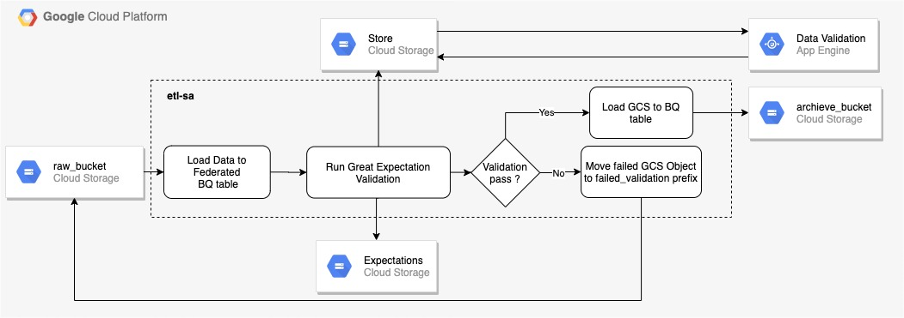
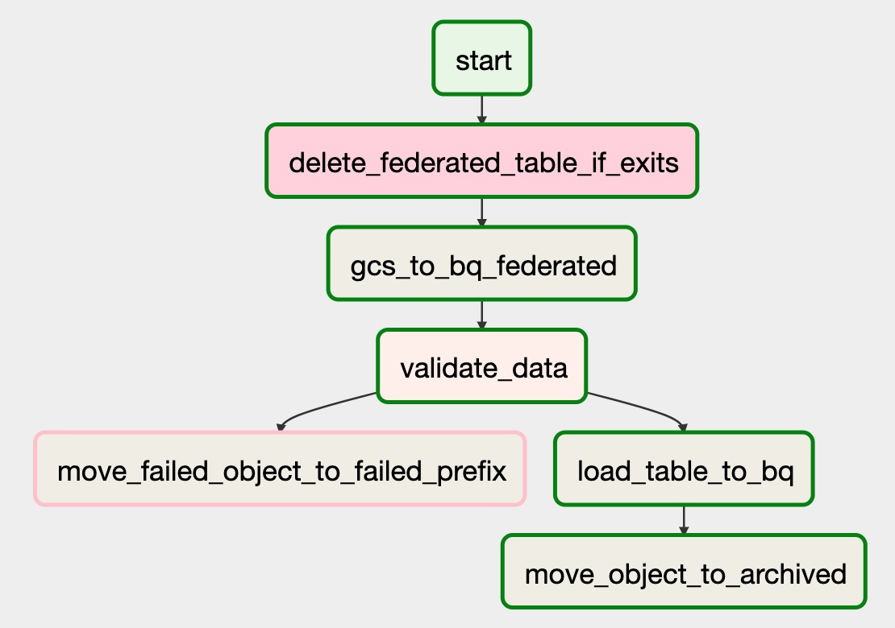
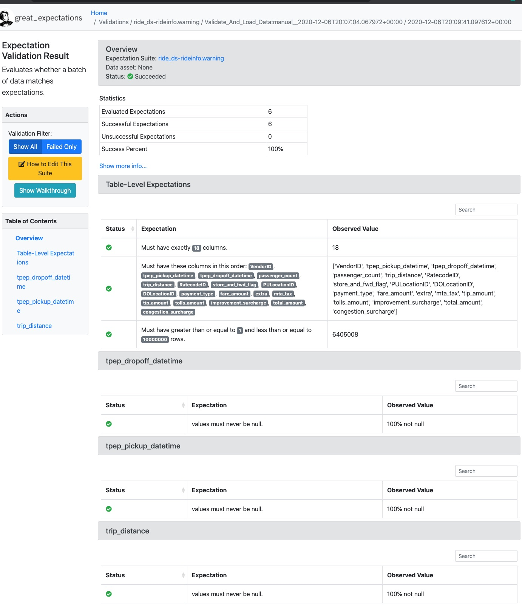

## Using Data Validation before Ingesting Data

In this blog, we run data validation ([Great Expectations](https://greatexpectations.io/)) from managed Airflow in GCP ([Cloud Composer](https://cloud.google.com/composer)). We store the validation result in a GCS bucket and serve it through Google App Engine. Each validation (run name) is based on the dag id and the corresponding run id. Similarly the validation rules (expectations) are stored in a separate GCS bucket. It enables us to deploy changes in expectations without redeploying the DAGs. Data validation is important if the data comes from untrusted sources. Before applying transformations on the data, making sure data is in proper format and is in expected form increases trustworthiness for your downstream data customers and reduces unnecessary cost to ingest and transform the data.

We create a workflow as shown in Figure below that reads the data from a raw_bucket (with prefix inbox). Loads the input_bucket data to BigQuery federated table (dataset name: ride_ds). We validate the data using the Great Expectations and then load the BigQuery table. Once loaded we move the data to the archive bucket. If the validation fails, we move the files to input_bucket (with prefix validation_failed). The dotted boundary in the figure is an airflow DAG process. We create a service account (etl-sa.json) and give it permission to read/write to input_bucket and archive_bucket, permission to read/write to BigQuery table and permission to create the BigQuery table. [App Engine](https://cloud.google.com/appengine) serves the validation result stored in the GCS bucket.



Let's walk through the whole process, first by creating the GCS bucket to store the validation result and expectation for the data sources. Let's create the BigQuery dataset.

```
export PROJECT_ID=<<project_id>>
export COMPOSER_ENV=<<composer_env>>
export COMPOSER_BUCKET=<<composer_bucket>>
export SITE_BUCKET=<<site_bucket>>
export STORE_BUCKET=<<store_bucket>>
export RAW_BUCKET=<<raw_bucket>>
export ARCHIVE_BUCKET=<<archive_buckeet>>
export BQ_DS=ride_ds
export LOCATION=us-central1
gsutil mb gs://$SITE_BUCKET
gsutil mb gs://$STORE_BUCKET
gsutil mb gs://$RAW_BUCKET
gsutil mb gs://$ARCHIVE_BUCKET
bq mk --dataset ${PROJECT_ID}.${BQ_DS}
```

#### Deploying App Engine

Validation results are stored in <<store_bucket>>. Replace in app.yaml

```
runtime: go113
env_variables:
 BUCKET: <<store_bucket>>
```
Run the following command to deploy Go App in Google App Engine

```
cd web-app
go build
gcloud config set project_id $PROJECT_ID
gcloud app deploy
```

Enable IAP and give access to the users (role: IAP-secured Web App User) who need access to Data Quality. Please follow the [link](https://cloud.google.com/context-aware-access/docs/securing-compute-engine#iap-enable) to enable IAP in App Engine.


#### Deploying DAG in Composer

We use Airflow [variables](https://airflow.apache.org/cli.html#variables) to set the variables such as gcp_project, raw_bucket, archive_bucket, site_bucket, store_bucket using the following command.

```
gcloud composer environments run ${COMPOSER_ENV} \
    --location ${LOCATION} variables -- --set gcp_project ${PROJECT_ID}
gcloud composer environments run ${COMPOSER_ENV} \
    --location ${LOCATION} variables -- --set raw_bucket ${RAW_BUCKET}
gcloud composer environments run ${COMPOSER_ENV} \
    --location ${LOCATION} variables -- --set archive_bucket ${ARCHIVE_BUCKET}
gcloud composer environments run ${COMPOSER_ENV} \
    --location ${LOCATION} variables -- --set site_bucket ${SITE_BUCKET}
gcloud composer environments run ${COMPOSER_ENV} \
    --location ${LOCATION} variables -- --set store_bucket ${STORE_BUCKET}
```

Similarly, let's create a connection ID. Download the service account and rename the service account as etl-sa.json. First upload the service account json to a prefix data on composer bucket and then create a connection id.

```
gsutil cp etl-sa.json gs://${COMPOSER_BUCKET}/data/
gcloud composer environments run ${COMPOSER_ENV} \
 --location ${LOCATION} connections -- --add \
 --conn_id=etl-sa --conn_type=google_cloud_platform \
 --conn_extra '{"extra__google_cloud_platform__project": "${PROJECT_ID}","extra__google_cloud_platform__key_path": "/home/airflow/gcs/data/etl-sa.json"}'
```

Let’s upload the composer DAG and the expectations in their respective bucket.

```
gsutil cp airflow/dags/ride_info_with_validation.py gs://${COMPOSER_BUCKET}/dags/
gsutil cp -R ge/expectations/* gs://${STORE_BUCKET}/expectations/${BQ_DS}-rideinfo/
```

Lets Download a Yellow taxi data from the [link](https://www1.nyc.gov/site/tlc/about/tlc-trip-record-data.page) and upload to RAW_BUCKET in the prefix inbox (`gsutil cp yellow_tripdata_2020-01.csv gs://${RAW_BUCKET}/inbox/`)



Above is a DAG deployed in Cloud Composer. For this example, we have five expectations listed below. The screenshot below shows the output of the Great Expectation result.
- expect_table_column_count_to_equal
- expect_table_columns_to_match_ordered_list
- expect_table_row_count_to_be_between
- expect_column_values_to_not_be_null [column: tpep_pickup_datetime]
- expect_column_values_to_not_be_null [column: tpep_dropoff_datetime]
- expect_column_values_to_not_be_null [column: trip_distance]



References:
- Getting started with Great Expectations, https://docs.greatexpectations.io/en/latest/guides/tutorials/getting_started.html#tutorials-getting-started
- Deploying Great Expectations with Google Cloud Composer (Hosted Airflow),https://docs.greatexpectations.io/en/latest/guides/workflows_patterns/deployment_google_cloud_composer.html
- Building a Go App on App Engine, https://cloud.google.com/appengine/docs/standard/go/building-app